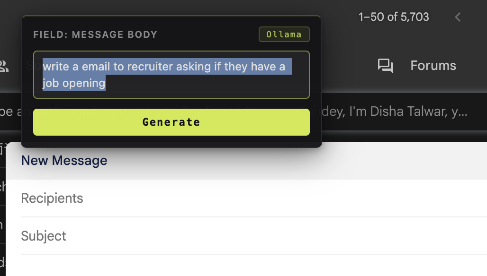
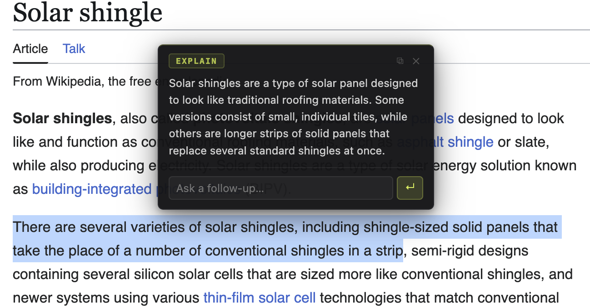
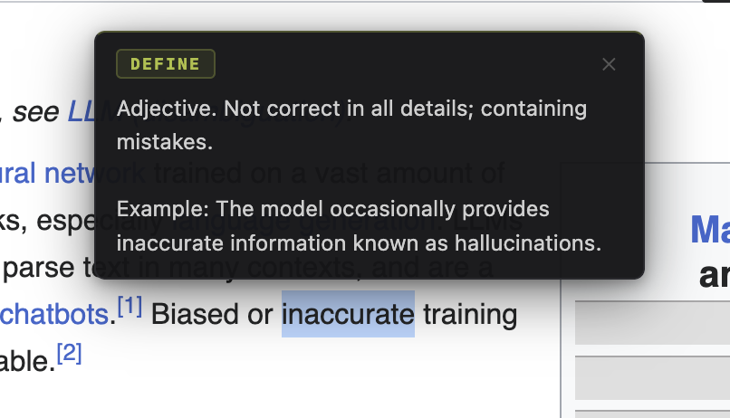

# Aide

> AI assistant living inside every web page — fill forms, explain text, define words.



---

## What it does

Aide injects a lightweight overlay on any page. Select text or focus a form field to unlock three actions:

| Action | Trigger | Result |
|--------|---------|--------|
| **Generate** | Focus any input / textarea | Describe what to write → AI fills the field |
| **Explain** | Select text | Floating summary of the selection |
| **Define** | Select a word | Definition + example sentence |

 

---

## Providers

Switch providers any time from the extension popup — no restart needed.

| Provider | Models |
|----------|--------|
| **Claude** | Sonnet 4.6 (default), Haiku 4.5, Opus 4.7 |
| **OpenAI** | GPT-4o, GPT-4o Mini, GPT-4 Turbo |
| **Gemini** | Gemini 3 Flash, Gemini 3.1 Flash Lite |
| **Ollama** | Any locally running model (auto-synced) |

Each provider stores its own API key, so you can flip between them without re-pasting credentials.

---

## Install

> Chrome Web Store listing coming soon. Load unpacked for now.

1. Clone or download this repo
2. Open `chrome://extensions`
3. Enable **Developer mode** (top right)
4. Click **Load unpacked** → select this folder
5. Click the Aide icon → pick provider → paste API key → **Save Settings**

For Ollama: start with CORS open so the extension can reach it, then click **↺ SYNC** in the popup to load local models. Default base URL is `http://localhost:11434`.

```
OLLAMA_ORIGINS="*" ollama serve
```

For Claude: extension calls `api.anthropic.com` directly from the browser, so requests include `anthropic-dangerous-direct-browser-access: true` alongside `x-api-key`. Key stays in `chrome.storage.sync`, never proxied.

---

## Usage

**Fill a form field**
1. Click into any `<input>` or `<textarea>`
2. Aide overlay appears above the field
3. Type a description of what to write
4. Hit **Generate** — content streams directly into the field

**Explain or define**
1. Highlight any text on the page
2. Choose **Explain** for a plain-English summary or **Define** for a dictionary-style entry
3. Dismiss with `×` or click elsewhere

Follow-ups are supported on any result — ask a clarifying question and the answer streams in place.

---

## Permissions

| Permission | Reason |
|------------|--------|
| `storage` | Save provider/model/API key settings |
| `host_permissions: <all_urls>` | Inject the overlay on any site |

API keys are stored in `chrome.storage.sync` — synced across your Chrome profile, never sent anywhere except the chosen provider's API.

---

## Development

No build step. Edit files, reload the extension in `chrome://extensions`.

```
aide/
├── manifest.json              # MV3 config
├── content/                   # Page overlay (injected on every frame)
│   ├── bootstrap.js           # Shadow root + guard against double-inject
│   ├── constants.js           # Shared selectors / sensitive-autocomplete patterns
│   ├── messaging.js           # SW bridge, settings cache, makeDraggable, streamExplain
│   ├── fields.js              # Input/textarea detection + insertion
│   ├── ui.js                  # Generate dropdown + fill-form preview
│   ├── selection.js           # Explain / Define / follow-up popup
│   ├── main.js                # Wiring / entry
│   └── content.css            # Overlay styles (loaded into the shadow root)
├── background/                # Service worker (ES module)
│   ├── index.js               # Router + warmup + context menus
│   ├── prompts.js             # System prompts + cleaners per action
│   ├── lib/                   # SW utilities
│   │   ├── http.js            # Error extraction
│   │   ├── retry.js           # Fetch wrapper with timeout + backoff
│   │   ├── streaming.js       # SSE / NDJSON line reader
│   │   └── history.js         # Persistent interaction log
│   └── providers/
│       ├── claude.js
│       ├── openai.js
│       ├── gemini.js
│       ├── ollama.js
│       └── index.js
├── popup/                     # Toolbar popup (provider/model/key + global toggle)
│   ├── popup.html
│   ├── popup.js
│   └── popup.css
├── settings/                  # Full settings page (profile, prefs)
│   ├── settings.html
│   ├── settings.js
│   └── settings.css
├── history/                   # Interaction history viewer
│   ├── history.html
│   ├── history.js
│   └── history.css
├── icons/                     # 16/48/128 PNGs
├── images/                    # README screenshots
└── tools/
    └── create-icons.js        # Regenerate PNG icons (node tools/create-icons.js)
```

Adding a provider: drop a new file in `background/providers/`, register it in `background/providers/index.js`, and add a tab + model list in `popup/popup.html` / `popup/popup.js`.

---

## License

MIT — see [LICENSE](LICENSE).
